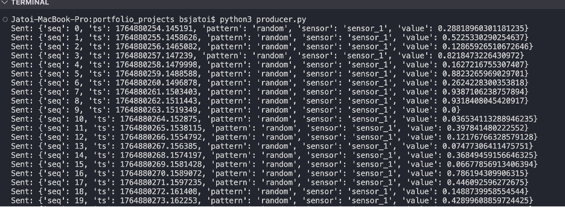
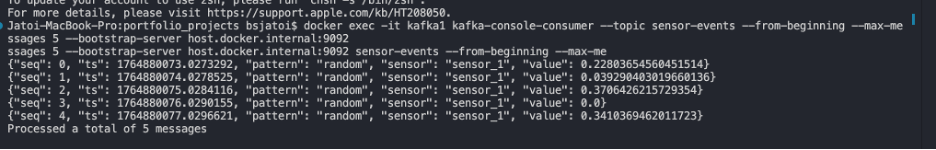
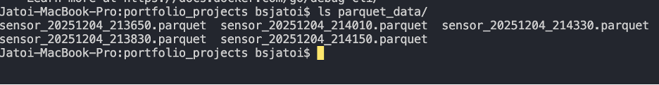
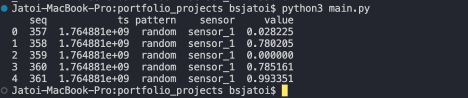
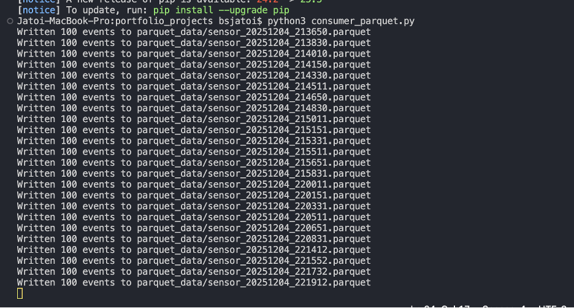
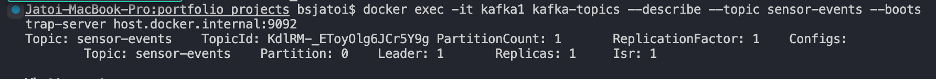
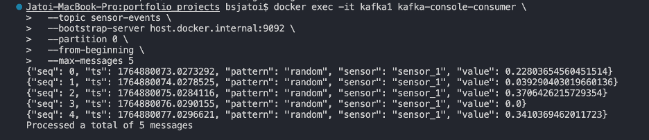
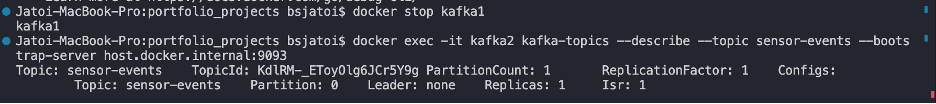
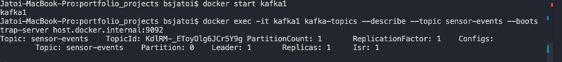

Streaming Sensor Data Pipeline
Overview

This project demonstrates a lightweight streaming pipeline using Python and Kafka. It reads simulated sensor data from an HTTP stream, sends it to a Kafka topic, and stores it in Parquet files for analytics. It also showcases Kafka partitioning and broker failover.

Features

Python producer: Reads HTTP NDJSON stream and publishes events to Kafka.

Python consumer: Reads Kafka messages and writes them to Parquet files.

Kafka cluster: Multi-broker setup using Docker Compose.

Partitioning & failover: Demonstrates leader election and partition distribution.

Setup

Start Kafka cluster:

docker compose up -d

Run producer:

python3 producer.py

Run consumer:

python3 consumer_parquet.py

Parquet files are saved in parquet_data/.

1.	Read HTTP Stream and Forward to Kafka
    -  Kafka is running
    

   - Producer sending messages
   

   - Kafka has received messages
   

   - Parquet files are created
   

   - Output of a Parquet file
   

   - Parquet files written
   

   Step 3 partitioning
   - Check partitions: here we an see partition IDs, leaders, and replicas
   
   - partition distribution
   
   All messages went to partition 0 because the producer uses a fixed key (sensor_1), which is hashed to partition 0.

   Let’s experiment  broker failover 
Stop kafka1:

After starting again Kafka1:
We see leader is back to 1

